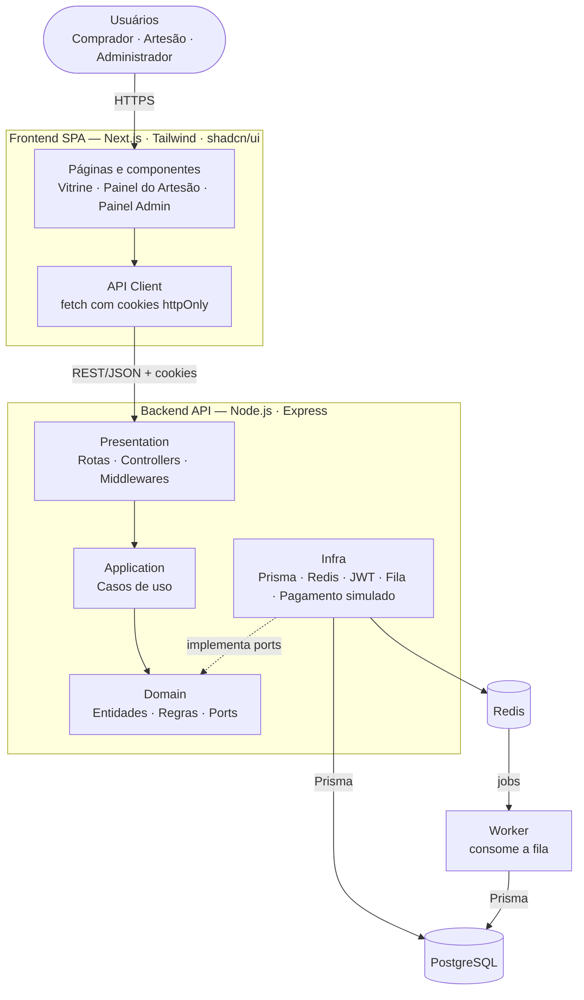

# Manoa — Marketplace da Economia Criativa e do Artesanato de Pernambuco

Aplicação web full stack que conecta artesãos de Pernambuco a compradores de todo o Brasil. Tem três ambientes: **vitrine do comprador**, **painel do artesão** e **painel administrativo**, além de um módulo de recomendação de produtos. O pagamento é simulado e os dados são sintéticos ou representativos.

## Integrantes

<table width="100%">
  <tr>
    <td align="center" width="33%">
      <a href="https://github.com/emanoelhenrick">
        <br />
        <b>Emanoel Henrick</b>
      </a>
    </td>
    <td align="center" width="33%">
      <a href="https://github.com/jenniferzeferino">
        <br />
        <b>Jennifer Zeferino</b>
      </a>
    </td>
    <td align="center" width="33%">
      <a href="https://github.com/RaieleLeite">
        <br />
        <b>Raiele Leite</b>
      </a>
    </td>
    
  </tr>
  <tr>
    <td align="center" width="33%">
      <a href="https://github.com/RayssaRR">
        <br />
        <b>Rayssa Santana</b>
      </a>
    </td>
    <td align="center" width="33%">
      <a href="https://github.com/FelipeLV12">
        <br />
        <b>Felipe Lopes</b>
      </a>
    </td>
    <td align="center" width="33%">
      <a href="https://github.com/injuje">
        <br />
        <b>José Leandro</b>
      </a>
    </td>
  </tr>
</table>

## Stack

| Camada | Tecnologia | Uso |
| --- | --- | --- |
| Frontend | Next.js + Tailwind CSS + shadcn/ui | Vitrine e painéis (SPA nas áreas logadas) |
| Backend | Node.js + Express | API REST em camadas |
| ORM e banco | Prisma + PostgreSQL | Usuários, catálogo, estoque e pedidos (transações ACID) |
| Autenticação | JWT em cookies `httpOnly` | Access token curto + refresh token com rotação |
| Cache | Redis | Cache da vitrine e das recomendações, rate limit |
| Assíncrono | Fila sobre Redis (ex.: BullMQ) | Recomendações e indicadores fora do checkout |

Redis e fila só entram onde fazem sentido: o fluxo principal (busca, carrinho, checkout) depende apenas do PostgreSQL, e o checkout é sempre síncrono e transacional.

## Documentação visual



A dependência aponta sempre para dentro (Presentation → Application → Domain). A Infra implementa os ports do domínio e só é ligada aos casos de uso em `config/container.ts`.

## Justificativa teórica

### Padrões GoF

| Padrão | Onde | Para quê |
| --- | --- | --- |
| **Strategy** | `domain/recommendation/` e `infra/recommendation/` | Alternar entre recomendação por atributos e por popularidade (fallback sem histórico) |
| **State** | `domain/orders/state/` | Cada estado do pedido só permite as transições autorizadas |
| **Decorator** | `infra/cache/CachedProductRepository` | Cache Redis sobre o repositório Prisma, com a mesma interface |
| **Adapter** | `infra/payment/SimulatedPaymentGateway` | Isolar o pagamento (simulado hoje, real no futuro) atrás de um port |
| **Observer** | `shared/events/DomainEventBus` | Efeitos do pedido confirmado (indicadores, notificação) sem acoplar ao checkout |
| **Chain of Responsibility** | `presentation/http/middlewares/` | `authenticate` → `authorize` → `validate` → controller |

### SOLID

| Princípio | Aplicação |
| --- | --- |
| **S** | Controller só trata HTTP; cada caso de uso faz uma coisa; repositório só persiste |
| **O** | Nova estratégia de recomendação ou novo estado de pedido é uma nova classe, sem editar o caso de uso |
| **L** | `PrismaProductRepository`, `CachedProductRepository` e a versão em memória (testes) seguem o mesmo contrato |
| **I** | Ports pequenos: `ProductReader` (comprador), `ProductWriter` (artesão), `PaymentGateway` (só `authorize`) |
| **D** | Casos de uso recebem ports pelo construtor; o domínio não importa Express, Prisma nem Redis |

### GRASP

| Padrão | Aplicação |
| --- | --- |
| **Information Expert** | `Cart.total()`, `Order.calculateTotal()` e `Product.hasStock()` ficam nas entidades que têm os dados |
| **Creator** | `Order` cria seus `OrderItem`; `Cart` cria seus `CartItem` |
| **Controller** | Controllers HTTP delegam; o caso de uso coordena o fluxo |
| **Low Coupling / High Cohesion** | Módulos por contexto (catálogo, carrinho, pedidos, recomendação), ligados por ports e eventos |
| **Polymorphism** | `OrderState` e `RecommendationStrategy` no lugar de `if` por tipo |
| **Pure Fabrication** | `PasswordHasher`, `DomainEventBus`, repositórios (não existem no domínio, mas mantêm as classes coesas) |
| **Protected Variations** | Ports protegem o sistema da troca de gateway (W01), do ORM e dos modelos de IA (W04) |

## Executando localmente

```bash
git clone <url-do-repositorio> && cd manoa
cp .env.example .env            # altere senhas e segredos
docker compose up --build
```

- Frontend: http://localhost:3000
- API: http://localhost:4000 (saúde em `/health`)

Sem container para as aplicações: `docker compose up -d manoa-db manoa-redis`, depois:

```bash
cd backend  && npm ci && npx prisma migrate dev && npx prisma db seed && npm run dev
cd backend  && npm run worker    # em outro terminal
cd frontend && npm ci && npm run dev
```

Testes: `npm test` em `backend/` e `frontend/`.

Variáveis principais do `.env`: `DATABASE_URL`, `REDIS_URL`, `JWT_ACCESS_SECRET`, `JWT_REFRESH_SECRET`, `CORS_ORIGIN`, `PORT` e `NEXT_PUBLIC_API_URL`. O `.env` nunca vai para o Git.

## Estrutura do repositório

Organização alvo, a ser construída conforme os módulos forem implementados.

```text
manoa/
├── docker-compose.yml
├── docs/                    # ficha e backlog SMART/MoSCoW
├── backend/
│   ├── prisma/              # schema, migrations, seed
│   └── src/
│       ├── config/          # env e container (injeção de dependências)
│       ├── shared/          # erros e event bus
│       ├── domain/          # entidades, estados, ports
│       ├── application/     # casos de uso e event handlers
│       ├── infra/           # prisma, cache, fila, auth, pagamento, recomendação
│       └── presentation/    # rotas, controllers, middlewares
└── frontend/src/
    ├── app/                 # rotas: (public), (buyer), (artisan), (admin)
    ├── components/          # ui/ (shadcn) e compartilhados
    ├── features/            # catalog, cart, orders, recommendations
    └── lib/                 # api-client e utilidades
```

## Convenções

- **Branches:** `main` (produção), `develop` (integração), `feature/...`, `fix/...`, `hotfix/...`.
- **Commits:** [Conventional Commits](https://www.conventionalcommits.org/) (`feat:`, `fix:`, `docs:`, `refactor:`, `test:`, `chore:`).
- **Pull Requests:** partem de `develop`, citam a história (ex.: `HU-C05`), têm pelo menos uma revisão e CI verde.

## Estado atual

Em fase de definição: ficha, backlog e arquitetura especificados. Próximas entregas: autenticação, catálogo, pedidos e recomendação, começando pelas histórias Must Have.